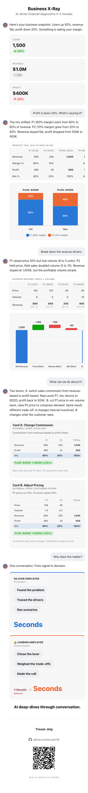

# Business X-Ray

AI-driven financial diagnostics in 3 minutes. A single-page, chat-style demo that walks
through a business problem (profit down 20% despite user growth), traces the drivers with
tables and charts, and lays out two levers to fix it, one turn at a time, styled like a
live conversation with an AI assistant.

Pure HTML, CSS, and JavaScript. No build step, no frameworks. Charts via [Chart.js](https://www.chartjs.org/).

**Live demo:** [yixuan116.github.io/business-x-ray/XT/](https://yixuan116.github.io/business-x-ray/XT/)

## Screenshots

The conversation unfolds one question at a time. Each screenshot below is the page state
after that step.

**Page 1, the snapshot loads automatically**

**Page 2, what's causing the drop**

**Page 3, the revenue drivers**

**Page 4, the two levers**

**Page 5, why it matters**

**Page 6, contact, revealed automatically at the end**



## Structure

```
business-x-ray/
  XT/
    index.html        the complete demo, one file
  screenshots/
  README.md
```

## Running locally

Open `XT/index.html` directly in a browser, or serve the folder:

```
cd XT
python3 -m http.server 8000
```

Then visit `http://localhost:8000`.

## Contact

Yixuan Jing, [github.com/yixuan116](https://github.com/yixuan116)
